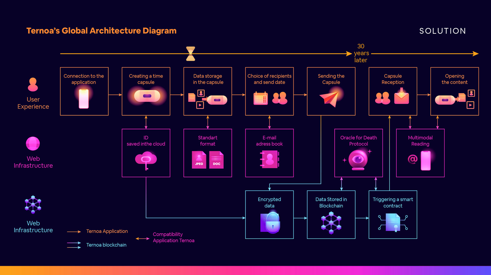
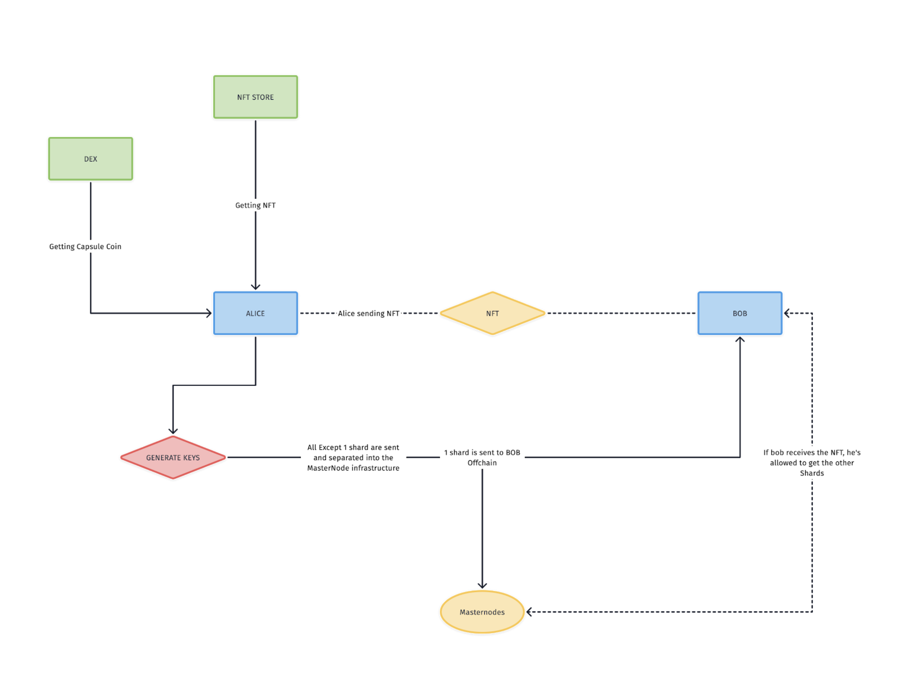
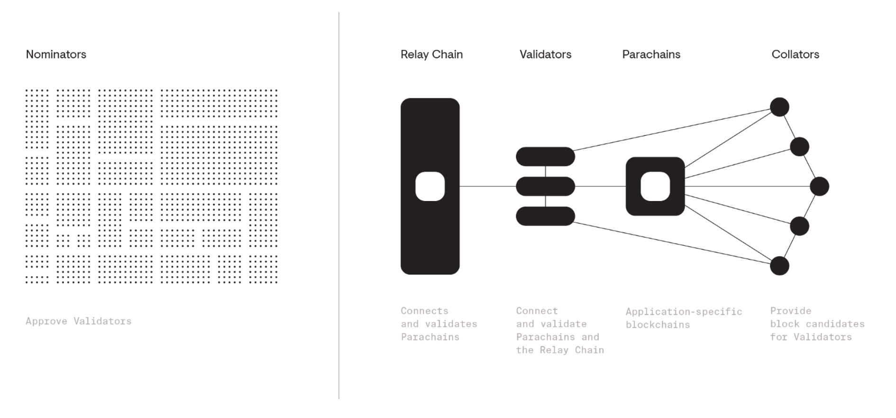
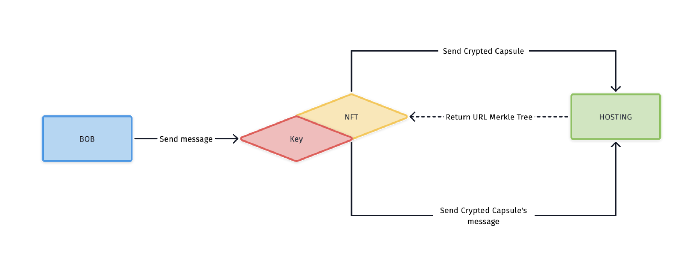
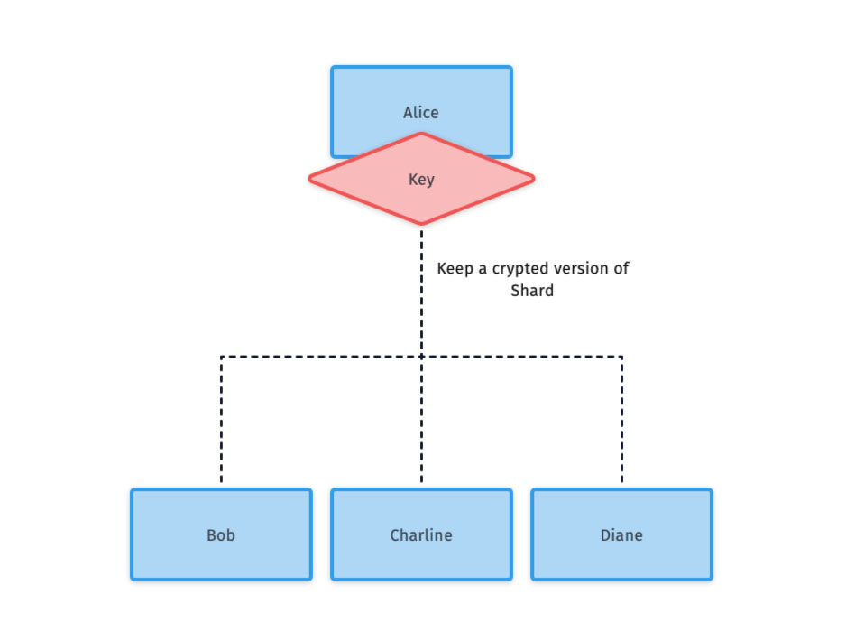
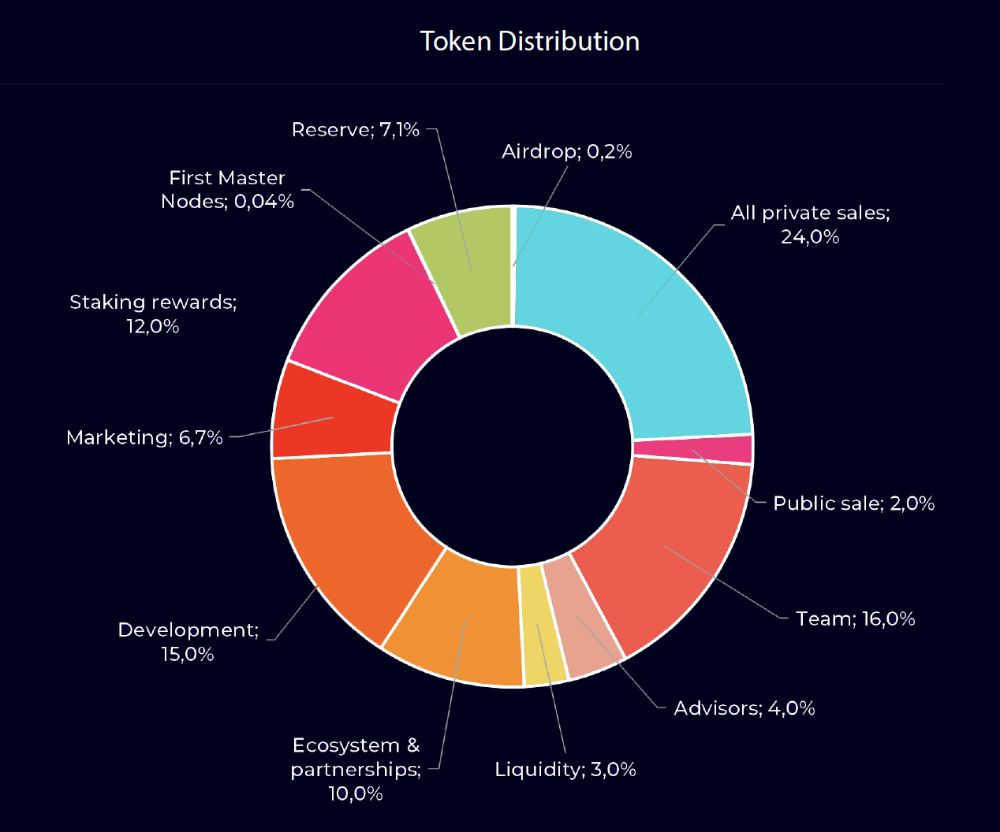
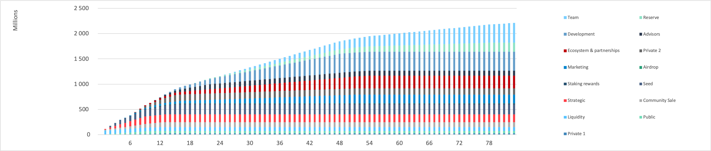

# TERNOA - White Paper

## Introduction

*« The present moment passes quickly, it is the memory that lasts »* Eugène Marbeau, Les remarques et pensées.

Who has never felt great joy in randomly rereading a few lines from their college diary? Who hasn't been moved by re-watching the video of their wedding? Which historian has not been amazed to find the archive dating from the 17th century allowing him to better understand the reign of Louis XIV?

Memories are an essential part of who we are. If memory plays an essential role in shaping us, then the truth is that memory is by its very nature a partial thing, and only media such as images, sound and texts enable us to keep and remember our past. These supports also allow us to transmit memories to succeeding generations so that they can continue to celebrate the memory of those who have left.

Memories are therefore precious goods that we must be able to treat as such. The paradox of the last few decades is to have succeeded in democratizing, thanks to digital technology, the production of memory-supports in an almost unlimited way, while at the same time having failed to offer solutions to preserve them over time. Indeed, it has become increasingly difficult to store all the data we create about our lives in a secure and reliable way. A USB key or a hard disk can be easily lost; storage clouds do not guarantee a strong respect for privacy; printed photos see their colours fade, etc...

Added to this is the difficulty of automatically and reliably transmitting them to third parties. How can we be sure that this video of myself, stored in some cloud, will be transmitted in 30 years, or after my death, to a loved one?

In response to these needs, Capsule Corp. is developing the Ternoa Blockchain. Designed to store and eventually transmit data in a secure way, Ternoa uses the state-of-the-art technology to secure the contents and the proper triggering of data transfers.

## The Ternoa Project

The development of the Blockchain is led by 3 main principles:

* A Blockchain infrastructure loyal to the essence of the technology: open source, decentralized and democratic;
* A service that is accessible and usable by the general public by focusing on user experiences optimized around everyday man-machine interfaces: web and mobile applications.
* A business model of the native token of the Ternoa Blockchain offering investors a clear, fair and directly correlated value creation trajectory to the success of the project.

These principles are implemented thanks to: The Blockchain Ternoa which allows the secure storage and transmission of data. A Software Development Kit (SDK) to facilitate the development of mobile or Web applications making the Blockchain Ternoa accessible to all use cases.

These two technological layers, developed by Capsule Corp. are compatible and interact with the Web infrastructure we know today.

## Use Case: Ternoa Temporal Capsules

Capsule Corp. will develop its own application called "Application Ternoa" from the SDK, in the description of this use case.

The Ternoa Application allows to create "Time Capsules" to encrypt, store, and transfer data in a secure way, and in a long time. These Time Capsules are non-fungible tokens issued on the Ternoa blockchain.

*Fig. 1: Functional diagram of how the Ternoa Blockchain is used by the Ternoa Application.*

The flows in green correspond to the steps in a user's journey through the Ternoa Application to create a time capsule and transmit digital data to specific beneficiaries. Eventually, four protocols will trigger the transmission of information:

* The Death Protocol for postmortem transmission;
* The Consent Protocol for a transmission based on the principle of activation of opening by third parties and non-opposition by the sender;
* The Safe Protocol to store searchable information in the form of a digital safe; and
* The D-Day Protocol to store and send data on a specified date.

The flows in blue correspond to the "off-chain" steps completed when creating and sending time capsules.

The flows in purple correspond to the steps of the journey operating on the Ternoa Blockchain:

* Data encryptions,
* Storage on decentralized servers of specialized blockchains (Storj, Sia, Arweave)
* Asymmetric transmission and decryption using Smart Contract

## Development ecosystem

The Ternoa Blockchain is based on the Substrate framework and the Polkadot Blockchain developed by Parity Technologies.

Substrate is a development environment created to facilitate the creation of Blockchains thanks to a modular architecture that allows to considerably reduce the development cost and time of a Blockchain. 

Substrate is a project led by Jutta Steiner, former Chief-Of-Security of the Ethereum foundation, and a team of more than 60 developers around the world. Polkadot is a Blockchain designed and developed to facilitate interoperability between different Blockchains while ensuring a high level of transaction scalability. Polkadot was created by Gavin Wood, co-founder of Ethereum.

The ecosystem formed by the Substrate framework and the Polkadot Blockchain stood out in 2020 as the first project not based on the Ethereum Blockchain to integrate Chainlink, a leading decentralized oracle network solution. And enabling it to become «the main provider of oracles for all Substrate-based blockchains and, ultimately, for the entire Polkadot network»

The Ternoa Blockchain is based on the substrate framework to offer:

* The use of delegated proof of stake (Nominated-Proof-of-Stake abbreviated to NPOS) to validate transactions and thus securing the data.
* The possibility to connect to other Blockchains to be able to store the data on specialized infrastructures.
* The creation of Smart Contracts in order to create the different protocols allowing data to be transmitted/to transmit the data.
* The management of Non-Fungible Tokens (NFT) which acts as a time capsule and allows the management of time capsules;

## Nominated proof of stake

The operation of a Blockchain is based on the creation of successive blocks of transactions. When creating these blocks, active community members check the validity of new transactions submitted, and are rewarded for their service to the community. Since the creation of the Bitcoin protocol in 2008, two validation methods are currently in competition:

proof of work (Proof-of-Work abbreviated as POW) linked to the principle of mining and provision of computing power by validation nodes to solve a mathematical problem, often hash tables; and the proof of stake (Proof-of-Stake abbreviated as POS) linked to the principle of staking, which means that the nodes must prove that they have in their possession a certain quantity of crypto-currency and put it pledged on the network.

The use of the POW for Blockchain networks is consubstantial to Bitcoin since it is the latter's validation method. With POW, the mining difficulty constantly adapts to the miners’ total performance in order to ensure a predictable and regular resolution time. When the solution is found, each machine checks its accuracy, and the new block is validated. One of the criticisms often made of the POW is the large consumption of energy that it requires to maintain the network security since it generates a kind of arms race among the network nodes to get more computing power.

Faced with the limitations and constraints of POW, POS was designed to solve the problem of POW energy consumption. It has become the validation method for many new blockchains and has recently gained in popularity with its adoption by Ethereum for its version 2.0, not without debate within the community. Rather than asking miners to perform energy-intensive calculations whose results are useless, users make themselves eligible for block validation by owning a certain amount of the cryptocurrency. The main argument put forward by POS defenders is the usefulness brought to the community by these users who allow a certain level of stability in the currency rate.

The Ternoa Blockchain is based on NPoS which is a variant of POS. The particularity of NPOS is based on a selection process of validators who are authorized to participate in the consensus protocol and is therefore similar to the Delegated-Proof-of-Stake (DPoS) used in particular by the Tezos Blockchain.

In this transaction validation system, there are Validators and Nominators that secure the Ternoa Blockchain in a complementary way.

Validators lock (stack) CAPS and participate in the development of the transaction validation consensus. Validators play a crucial role in securing transactions by ensuring the validity of the information contained in transaction blocks and the production of new blocks. In return for this work, Validators receive CAPS per validated transaction block. On the other hand, if the network notices that a Validator is trying to validate or produce erroneous information, it is sanctioned and all or part of the locked CAPS are removed. Nominators select the right Validators to delegate the management of the CAPS that they wish to lock.

This system creates a virtuous circle: Validators compete to provide the best performance conditions for the Nominators while the Nominators provide the Validators with a higher volume of locked CAPS.

## Interoperability and file storage

The choice to develop the Ternoa Blockchain on the Substrate framework facilitates its interoperability with other existing Blockchains. Thus, the Ternoa Blockchain redirects the files to be stored to other Blockchains specialized in decentralized storage such as Storj, Sia or Arweave.

This solution is the most advantageous in terms of security and resilience of the model since the files are stored on several different infrastructures ensuring that at least one copy of the preserved data is always available.

It is also advantageous from an economic point of view since the Ternoa Blockchain is based on infrastructures that have already financed the development cost necessary to offer decentralized storage solutions.

This delegated storage system is completely invisible from the end user’s point of view as it is located at the lower layers of the Ternoa project infrastructure.

## Smart Contracts and transfer protocols

Several transmission protocols have been developed in the form of Smart Contracts by Ternoa. Thus, Dapps can be created and can use these transfer protocols. Examples of the use of these protocols have been detailed in chapter “2. Use case: Ternoa Time Capsules”.

### Safe Protocol

The user can store data on the Ternoa Blockchain for a defined period of time, and can access it at any time.

### D-DAY Protocol

The user chooses a day/month/year when the capsule will be sent.

*ex: Alice wants to prepare a capsule for Bob who has to go abroad on January 17, 2021. She prepares a capsule for her and for him with all the necessary elements inside: tickets, hotel reservations, etc.*

*ex: Bob prepares a capsule for Alice's 40th birthday. He adds messages and photos that will automatically be sent to Alice on D-Day.*

### Countdown

The user defines a number of days before sending the capsule. He has the possibility to reset the countdown as many times as he wants.

*ex: Alice goes alone to the mountain for a hike. She schedules a backup capsule that will be sent to Bob if she does not connect for 3 days.*

*ex: Bob wishes to give Alice his Ledger keys so that she can manage his crypto currencies after his death. Not wishing to indicate his identity, he creates a capsule with a 1-year countdown.*

### Consent Protocol

The user authorizes a group to trigger the sending of a capsule. The user has a time limit to oppose it.

*ex: Alice manages the Wallet of a large SME. She has a stroke and ends up in hospital. The group of Bob, Christelle and Diane are designated as authorized to send the capsule. They trigger the action and Alice does not oppose it, the entitled party gets the keys to the wallet.*

### Death Protocol

Unique per country, based on the APIs of public death registers, the Death Protocol triggers the transmission of the capsule when the official registration of the beneficiary's death is made...

*ex: Alice had a car accident and passes away. She appears in the death register. The oracle becomes aware of it and transfers the capsule to its beneficiaries.*

### dApps

On the first version, the RUST language (via INK!) will be used to manage smart contracts. Smart contracts allow functions to be performed on the blockchain and offer the possibility for the community to develop applications on the Ternoa blockchain.

## 7. Time Capsule Workflow

The Ternoa Blockchain uses NFTs as “time capsules”. Prior to sending a time capsule, the user must provision their CAPS wallet and must purchase a Ternoa compatible NFT.

*Fig. 2. Functional diagram of NFTs transmission on the Ternoa Blockchain.*

From the point of view of the Ternoa Blockchain, a capsule creation consists of:

* Provision the servers that host the data to ensure that they are remunerated for the rental of storage space over the long term.
* Define the type of capsule in the NFT according to the previously defined protocols;
* Create the link to the file tree in the NFT;
* Generate asymmetric keys and Shamir's secret keys to guarantee the maximum level of security of the data and access to the capsule;
* Generate a symmetric secret and encrypt it with the asymmetric key;
* Send shards to the masternode network to validate the transactions.

## NFT Structure and Files

Non-fungible token (NFT) The Non-fungible-token module provides basic functions to create and manage NFTs such as create_class, transfer, mint, burn, destroy_class. Ternoa uses NFTs as time capsules.

The most common NFTs are ERC721. We can add inside the metas we want and in our case, here are their compositions:

    "id" : "",
    "name" : "",
    "image" : "",
    "uri" : [],
    "pk_hash" : "",
    "owner" : "",
    "creator" : ""

The basic NFTs will be designed by TERNOA and NFT marketplace will be deployed in 2021. This marketplace is based on the SubstraPunk project and allows any creator to have the opportunity to offer and sell TERNOA-compatible NFTs.

## Data decentralization

The Ternoa Blockchain is designed to be a Parachain of the Polkadot network. Thus, it will have its own network of servers and at the same time use the Ternoa network to decentralize data.

*Fig. 3 - polkadot parachain relay system.*

The data is encrypted and then sent to various decentralized servers. We will use for each message a merkle tree composed of all the files to be recovered to recompose the message. It will be the same for the capsule, it will be composed of the files that make up the messages.

*Fig. 4 - Decentralized storage.*

## Asymmetric encryption and security

### Trusted Friends

‘Trusted Friend’ is a M-of-N social recovery module that allows users to access their accounts in case of loss of the private key or other authentication mechanism. Thanks to Trusted Friends, a user is able to make calls on behalf of another account that they have recovered. The recovery process is protected by trusted “friends” which the original account owner chooses. A threshold (M) of N friends is necessary to allow another account to access the recoverable account.

### Identity

All accounts can have an unlimited number of sub-accounts specified. By definition, these have an equivalent property and each one has an individual name. On Ternoa, each capsule is owned by a sub-account. Only the owner can access it before the transmission protocol is triggered.

As we mentioned previously, only the recipients of the capsule are able to decipher it.

The primary shard is transferred “Off-Chain” via various vectors: from the mobile application, from a physical medium (ledger, etc.) or via a specialized HSM service (Amazon, Google).

### Backup of the capsule shard

Each capsule has a unique shard which allows the NFT owner to decipher it. This shard can be encrypted and saved on different cloud services: mobile Cloud, dropbox, etc... And it can be exported in TXT format. In case the phone is changed or lost, the user once connected to his wallet will be able to reimport and decrypt the shard.

*Fig. 5 - P2P off-chain storage of keys.*

The social module will allow you to see your key stored off-chain on the P2P mobile network. To benefit from this option free of charge, you must also agree to hold encrypted keys of other users.

*Fig. 6 - P2P off-chain stockage of keys.*

The other shards will be stored on the Masternodes. If the owner of the NFT requests access to the shards, the network tells him if the other conditions are valid. These conditions are managed by the protocols set out below.

## Behavior of masternodes

Masternodes in NPoS hold parts of Shamir without ever holding all of the keys. And are not able to know who they belong to. Each masternode is independent and has no knowledge of the data of the other Masternodes. Masternodes are instructed to return the shards upon request of the NFT owner concerned, if and only if the conditions for the transmission are met.

Adding a message Adding a message consists of: Encrypting a file (json/base64/media) with the symmetric key. Addition of this document on the file server and modification of the tree.

Delete a message: Deleting a message consists of updating the file tree.

## Governance

The Democracy module manages the administration of the general stakeholder vote.
Ternoa offers Capsule Coins holders to be actors of the network and to have a decision-making power regarding blockchain governance: developments, partners, protocols, etc.
There are two different queues to which a proposal can be added, before it becomes a referendum:
* the proposal queue comprising all public proposals, and
* the external queue comprising of a single proposal that comes from one of the external origins (such as a collective group).
* At each launch period, a referendum is created from a proposal taken in turn from the proposal queue or from the external queue. Any Capsule Coins holder in the system can vote on referendums. The voting system uses a fixed time vote by allowing the token holder to fix his or her conviction behind the vote. The Conviction dictates how long the tokens are locked for, as well as the multiplier that scales the power of the vote.

## Economic model

The CAPS is the token of the Ternoa Blockchain. Transactions made on the Ternoa blockchain are settled in CAPS, namely:
* Creation of NFT
* Encryption
* data storage over time

The volume of demand for NFTs on the one hand, and for their storage over time on the other hand, are the two factors of appreciation for Capsule Coin in secondary markets.

### Capsule Coin Token

* Symbol: "CAPS"
* Total Supply: 2 500 000 000 CAPS (2.5 billion)
* ICO price: 0.008 € / CAPS
* At of the ICO date Capsule Coins are erc20 tokens. A bridge shall be implemented, on or before the Main Net launch. This bridge shall allow Capsule Coin erc20 holders to transfer them on the Ternoa blockchain, on a 1 for 1 basis

### Distribution of Tokens

### Token release rules

|                Categories       |          Vesting                                                                                     |
| :-------------------- | :-------------------------------------------------------------------------------------------: |
| Airdrop               |     Locked for 4 months after listing, 40% on first release, then 30% two months later and 30 % again four months later.                  |
| Seed          |     Locked for 1 month after listing, 13% per month on the first 3 months, then equal parts of 5% over a total of 15 months​  |
| Community Sale        |     15% at listing, 6% per month on the first 4 months, then equal parts of 8% over a total of 13 months​  |
| Private Sale         |     Locked for 6 months, 10% on first release, then equal parts of 11% over a total of 9 months​  |
| Public      |     10% at listing, then equal parts of 11% over a total of 9 months             |
| Strategic           |     10% at listing, then equal parts of 11% over a total of 9 months                |
| Team Founders              |     Locked for 24 months, 2% on first release, then equal parts of 2% over a total of 60 months                  |
| Advisors              |     Locked for 10 months, 8% on first release, then equal parts of 8% over a total of 12 months                  |
| Ecosystem & partnerships             |     Locked for 6 months, 2% on first release, then equal parts of 2% over a total of 48 months                 |
| Development              |     Locked for 12 months, 3% on first release, then equal parts of 3% over a total of 36 months                  |
| Marketing             |     Locked for 3 months, 2% on first release, then equal parts of 2% over a total of 48 months                  |
| Reserve             |     Locked for 18 months, 2% on first release, then equal parts of 2% over a total of 60 months                  |

\*: TGE: February 26th of 2021
\*: Listing: Q2 of 2021

### Core Team

#### Mickael Canu - CEO & CTO

Co-founder and CTO of several start-ups, Mickael has designed and developed various smart contracts on Ethereum: addressing general assemblies (SYMENT), hashing (contractchain V2) and probative value archiving (OVERHEADS). with Computer Science from the University of Osaka, Mickaël is a blockchain lecturer and teaches development courses on Ethereum at the Wild Code School.

#### Clément Téqui - CFO

Coming from the financial advisory sector and specialist in Token Economics, Clément created the blockchain practice of the Accuracy firm. He advised notably the ICO of Peculium (€ 9m) and sits on the Board of Linkcy. Graduate of ESCP, he is the author of the book "Blockchain, vers de nouvelles chaînes de valeur (Blockchain, towards new value chains)" (Edition Eyrolles) and teaches courses on the strategic challenges of blockchain at the University of Paris Dauphine and at the Ecole Polytechnique.
  
#### Eliott Teissonniere - Blockchain Architect

Lead Blockchain Architect at Nodle, Eliott has also developed the first marriages dApp on Ethereum, and is the co-holder of several patents related to the blockchain technology. Former CTO of BitNation (project awarded by UNESCO in 2017), Eliott is also a mentor at the Berkeley Blockchain Accelerator, and intervened at Paris Blockchain Week, and at the Stanford Blockchain Conference.

Our team is growing, check this out : www.ternoa.com
