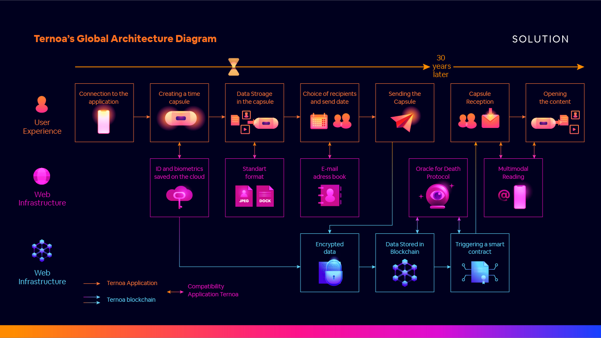
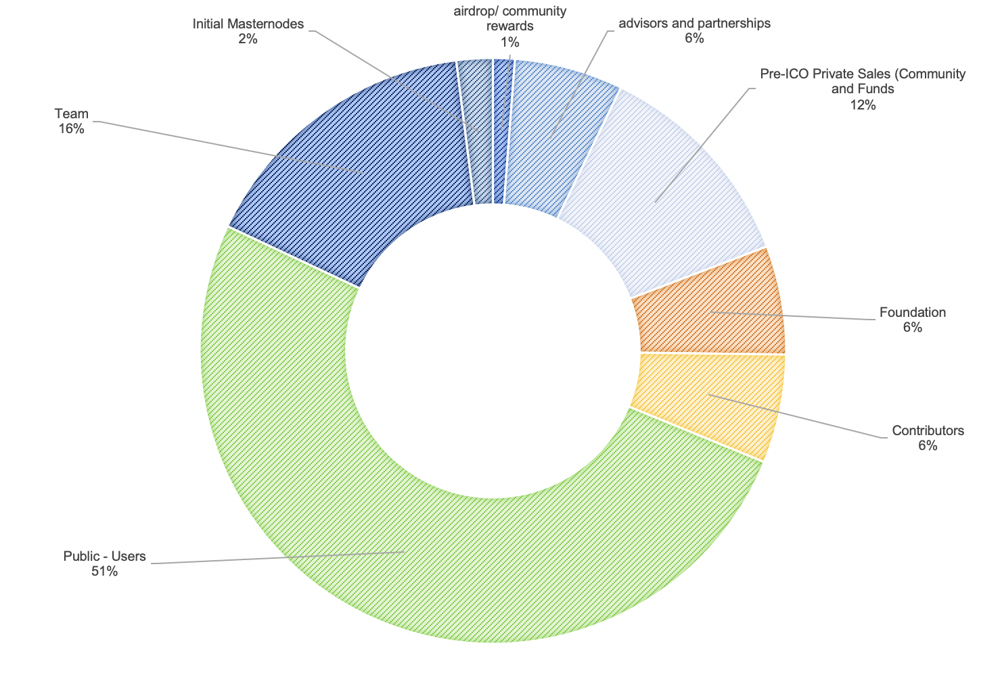

# TERNOA - White Paper

## Avant propos

*« Le moment présent est vite passé, c’est le souvenir qui dure »* Eugène Marbeau, Les remarques et pensées.

Qui n’a jamais ressenti une grande joie en relisant au hasard quelques lignes de son journal intime du collège ? Qui ne s’est pas ému en re-regardant la vidéo de son mariage ? Quel historien ne s’est pas émerveillé retrouvant l’archive datant du 17ème lui permettant de mieux comprendre le règne de Louis XIV ?

Les souvenirs constituent une part essentielle de ce que nous sommes. Si la mémoire joue un rôle essentiel dans la création de ces derniers, il n’en demeure pas moins qu’elle est par nature partielle et que seuls les supports tels que les images, le son et les textes permettent de fixer et se remémorer ce que nous avons été. Les supports donnent également la possibilité de transmettre les souvenirs aux générations qui nous succèdent afin qu’elles puissent continuer à célébrer la mémoire des personnes parties.  

Les souvenirs sont donc des biens précieux qu’il s’agit de pouvoir traiter comme tel. Le paradoxe des dernières décennies est d’avoir réussi à démocratiser, grâce au numérique, la production de supports de souvenirs de manière quasi illimitée mais d’avoir échoué à offrir des solutions pour les conserver sur le temps long.  Il est devenu, en effet, de plus en plus difficile de stocker toutes ces données que nous créons sur nos vies de manière sécurisée et fiable. Une clé USB ou un disque dur peuvent se perdre facilement, les clouds de stockage ne garantissent pas un respect fort de la vie privée, les photos imprimées voient leurs couleurs se ternir, etc.

À cela s’ajoute la difficulté de les transmettre de manière automatique et fiable à des tiers. Comment s’assurer que cette vidéo de moi, stockée sur un cloud quelconque, pourra être transmise dans 30 ans ou après ma mort à une personne qui m’est chère ?

Pour répondre à ces enjeux, Capsule Corp. développe la blockchain Ternoa. Conçue pour stocker et transmettre à terme, de manière sécurisée, des données. Ternoa mobilise l’état de l’art de la technologie pour sécuriser les contenus et le bon déclenchement des transferts de données.

## Le Projet Ternoa

Le développement de la Blockchain est guidé par 3 grands principes :

Une infrastructure Blockchain fidèle à l’essence de la technologie à savoir : open source, décentralisée et démocratique ;

* Un service accessible et utilisable par le grand public en faisant la part belle aux expériences utilisateurs optimisées autour d’interfaces homme-machine du quotidien : les applications web et mobiles.
* Un modèle économique du Token natif de la Blockchain Ternoa proposant aux investisseurs une trajectoire de création de valeur claire, équitable et directement corrélée au succès du projet ; 

Ces principes sont mis en oeuvre grâce à :
La Blockchain Ternoa qui permet le stockage et la transmission sécurisée des données.
Un kit de développement de logiciel (Software Development Kit, SDK) permettant de faciliter le développement des applications mobiles ou Web rendant ainsi accessibles à tous les cas d’usages de la Blockchain Ternoa.

Ces deux couches technologiques, développées par Capsule Corp., sont compatibles et interagissent avec l’infrastructure Web que nous connaissons aujourd’hui. 

## Cas d’usage : Capsules Temporelles Ternoa

Capsule Corp. développera à partir du SDK sa propre application, appelée « Application Ternoa » dans la description de ce cas d’usage.

L’Application Ternoa permet de créer des “Capsules Temporelles” pour chiffrer, stocker, et transférer des données de manière sécurisée, et dans le temps long. Ces Capsules Temporelles sont des jetons non-fongibles émis sur la blockchain Ternoa.

*Fig. 1: Schéma fonctionnel d’utilisation de la Blockchain TERNOA par l’Application Ternoa.*

Les flux en vert correspondent aux étapes du parcours d’un utilisateur sur  l’Application Ternoa pour  créer une capsule temporelle et transmettre des données numériques à des bénéficiaires déterminés. A terme, quatre protocoles permettront de déclencher la transmission de l’information :

* Le Death Protocol pour une transmission post mortem ;
* Le Consent Protocol pour une transmission basée sur le principe d’activation d’ouverture par des tiers et de non-opposition par l’émetteur ;
* Le Safe Protocol pour stocker de l’information consultable sur le modèle d’un coffre-fort numérique ; et
* Le D-Day Protocol pour stocker et d’envoyer de la donnée à une date déterminée.

Les flux en bleu correspondent aux étapes “off-chain” complétées lors de la création et de l’envoi de capsules temporelles.

Les flux en violet, correspondent aux étapes du parcours fonctionnant sur la Blockchain Ternoa:

* Chiffrage des données,
* Stockage sur serveurs décentralisés de blockchains spécialisées (Storj, Sia, Arweave)
* Transmission et déchiffrage asymétrique grâce à l’utilisation de Smart Contract

## Écosystème de développement

La Blockchain Ternoa s’appuie sur le framework Substrate et la Blockchain Polkadot développés par Parity Technologies.

Substrate est un environnement de développement créé pour faciliter la création de Blockchains grâce à une architecture modulaire qui permet de réduire considérablement le coût et le temps de développement d’une Blockchain. Substrate est un projet porté par Jutta Steiner, ex Chief-Of-Security de la fondation Ethereum, et une équipe de plus de 60 développeurs à travers le monde.
Polkadot est une Blockchain pensée et développée pour faciliter l’interopérabilité entre différentes Blockchains tout en garantissant un haut de niveau de scalabilité des transactions. Polkadot a été créé par Gavin Wood, co-fondateur d’Ethereum.

L’écosystème formé par le framework Substrate et la Blockchain Polkadot s’est fait remarquer en 2020 comme étant le premier projet non basé sur la Blockchain Ethereum à intégrer Chainlink, solution leader de réseaux d’oracles décentralisés. Et permettant à ce dernier de devenir « le principal fournisseur d’oracles pour toutes les blockchains basées sur Substrate et, à terme, pour l’ensemble du réseau Polkadot »

La Blockchain Ternoa repose sur le framework substrate pour offrir :

* L’utilisation de la preuve d’enjeu déléguée (Nominated-Proof-of-Stake abrégé en NPOS) pour la validation des transactions et ainsi sécuriser la donnée.
* La possibilité de se connecter à d’autres Blockchains pour pouvoir stocker la donnée sur des infrastructures spécialisées.
* La création de Smart Contracts afin de créer les différents protocoles permettant de transmettre la donnée.
* La gestion des Non Fongible Token (NFT) qui joue le rôle de capsule temporelle et permette la gestion des capsules temporelles ;

## Nominated proof of stake

Le fonctionnement d’une Blockchain repose sur la création de blocs de transactions successifs. Lors de la création de ces blocs, les membres actifs de la communauté vérifient la validité des nouvelles transactions soumises, et touchent ainsi une récompense pour avoir rendu service à la communauté. Depuis la création du protocole Bitcoin en 2008, deux méthodes de validation sont à ce jour en concurrence :

la preuve de travail (Proof-of-Work abrégé en POW) liée au principe de minage et de mise à disposition d’une puissance de calcul par les noeuds de validation pour résoudre un problème mathématiques, souvent des tables de hachage ; et
la preuve d’enjeu (Proof-of-Stake abrégé en POS) liée au principe de staking c’est-à-dire que les nœuds doivent prouver qu’ils ont en leur possession une certaine quantité de crypto-monnaies et la mettre en gage sur le réseau.

L’utilisation du POW pour les réseaux Blockchain est consubstantiel au Bitcoin puisque c’est la méthode de validation de ce dernier. Avec le POW la difficulté de minage  s'adapte en permanence à la performance totale des mineurs afin d'assurer un délai de résolution prévisible et régulier. Lorsque la solution est trouvée, chaque machine en vérifie l'exactitude, et le nouveau bloc est validé. Une des critiques souvent faite au POW est la grande consommation d’énergie qu’elle nécessite pour entretenir la sécurité du réseau puisqu’elle engendre une sorte de course à l’armement chez les nœuds du réseau pour avoir une puissance de calcul toujours plus grande.

Face aux limites et contraintes de la POW, la POS a été pensée pour résoudre le problème de consommation d’énergie du POW. Elle est devenue la méthode de validation de nombreuses nouvelles blockchains et a notamment récemment gagné en popularité avec son adoption par Ethereum pour sa version 2.0, non sans débat au sein de la communauté. Plutôt que de demander aux mineurs d'effectuer des calculs énergivores dont les résultats sont inutiles, les utilisateurs se rendent éligibles à la validation de blocs en possédant une certaine quantité de la cryptomonnaie. Le principal argument avancé par les défenseurs de la POS est l'utilité apportée à la communauté par ces utilisateurs qui permettent un certain niveau de stabilité du cours de la monnaie. 

La Blockchain Ternoa s'appuie sur la NPoS qui est une variante du POS. La particularité du NPOS repose sur un processus de sélection des validateurs qui sont autorisés à participer au protocole de consensus et se rapproche en cela de la Delegated-Proof-of-Stake (DPoS) utilisée notamment par la Blockchain Tezos.

Dans ce système de validation des transactions, il existe des Validator et des Nominator qui sécurisent la Blockchain Ternoa de façon complémentaire.

Les Validator verrouillent (stakent) des CACO et participent à l’élaboration du consensus de validation des transactions. Ils jouent un rôle crucial dans la sécurisation des transactions puisqu’ils sont garants de la validité des informations contenues dans les blocs de transactions et de la production des nouveaux blocs. En contrepartie de ce travail, les Validators reçoivent des CACO par bloc de transaction validée. En revanche, si le réseau s’aperçoit qu’un Validator essaye de valider ou produire des informations erronées, il est sanctionné et se voit retirer tout ou partie des CACO verrouillés. Les Nominators sélectionnent les bons Validators pour leur déléguer la gestion des CACO qu’ils souhaitent verrouiller. 

Ce système crée un cercle vertueux: les Validators sont en compétition pour offrir les meilleures conditions de rendement aux Nominators tandis que ces derniers apportent aux Validators un volume de CACO verrouillés plus important.

## Interopérabilité et stockage des fichiers

Le choix de développer la Blockchain Ternoa sur le framework Substrate permet de faciliter son interopérabilité avec d’autres Blockchains existantes. Ainsi, la Blockchain Ternoa redirige les fichiers à stocker vers d’autres Blockchains spécialisées dans le stockage décentralisé comme Storj, Sia ou Aerweave.

Cette solution est la plus avantageuse en termes de sécurité et de résilience du modèle puisque les fichiers sont stockés sur plusieurs infrastructures différentes garantissant d’avoir toujours à disposition à minima une copie des données préservées.

Elle est également avantageuse d’un point de vue économique puisque la Blockchain Ternoa s’appuie ainsi sur des infrastructures ayant déjà financé le coût de développement nécessaire pour proposer des solutions de stockage décentralisées. 

Ce système de stockage délégué est entièrement invisible du point de vue de l’utilisateur final puisqu’il se situe au niveau des couches basses de l’infrastructure du projet Ternoa.

## Smart Contracts et protocoles de transfert

Plusieurs protocoles de transmission sont développés sous forme de Smart Contract par Ternoa. Ainsi, des Dapps pourront être créés et pourront utiliser ces protocoles de transfert. Des exemples d’utilisation de ces protocoles ont été détaillés dans le chapitre “2. Cas d’usage : Capsules Temporelles Ternoa”. 

### Safe Protocol

L’utilisateur peut stocker de la donnée sur la Blockchain Ternoa pour une durée définie, et la consulter à tout moment.

### D-DAY Protocol

L'utilisateur choisit un jour/mois/année ou la capsule sera envoyée.

*ex : Alice souhaite préparer une capsule pour Bob qui doit partir à l'étranger le 17 janvier 2021. Elle prépare une capsule pour elle et pour lui avec à l'intérieur tous les éléments nécessaires : billets, réservation d'hôtels, etc.*

*ex : Bob prépare une capsule pour l'anniversaire des 40 ans d'Alice. Il y ajoute des messages et photos qui automatiquement seront transmis à Alice le jour J.*

### Compte à rebours

L'utilisateur définit un nombre de jours avant l'envoi de la capsule. Il a la possibilité de réinitialiser le compte à rebours autant de fois qu'il le souhaite.

*ex : Alice part seule à la montagne pour faire une randonnée. Elle programme une capsule de secours qui sera envoyée à Bob si jamais elle ne se connecte pas pendant 3 jours.*

*ex : Bob est militaire et souhaite donner ses clés de Ledger Alice pour qu'elle puisse gérer ses cryptos monnaies, si jamais il lui arrivait quelque chose. En ce sens, il crée une capsule avec un compte à rebours de 1 an avant de partir en mission.*

### Consent Protocol

L'utilisateur autorise un groupe à déclencher l'envoi d'une capsule. L'utilisateur a un délai pour s'y opposer.

*ex : Alice gère le Wallet d'une grosse PME. Elle fait un AVC et se retrouve à l'hôpital. Le groupe de Bob, Christelle et Diane sont désignés comme autorisés à envoyer la capsule. Ils déclenchent l'action et Alice ne s'y opposant pas, l'ayant droit récupère les clés du wallet.*

### Death Protocol

Unique par pays, basé sur les API des registres publics de décès , le Death Protocol déclenche la transmission de la capsule lors de l’enregistrement officiel du décès du bénéficiaire..

*ex : Alice a un accident de voiture et perd la vie. Elle apparaît dans le registre des décès. L'oracle en prend connaissance et transfère la capsule à ses bénéficiaires.*

### dApps

Sur la première version, le langage RUST (via INK!) sera utilisé pour gérer les smart contracts. Les smarts contracts permettent d’exécuter des fonctions sur la blockchain et offrent la possibilité à la communauté de développer des applications sur la blockchain Ternoa.

## 7. Workflow des Capsules Temporelles

La Blockchain Ternoa utilise des NFT comme “capsules temporelles”. Préalablement à l’envoi d’une capsule temporelle, l’utilisateur doit se provisionner son wallet de Capsule Coin et doit acheter un NFT compatible Ternoa.

*Fig. 2. Schéma fonctionnel de la transmission des NFT sur la Blockchain Ternoa.*

De point de vue de la Blockchain Ternoa, une création de capsule consiste à :

* Provisionner les serveurs qui hébergent les données afin d’assurer leur rémunération pour la location de l’espace de stockage sur le temps long.
* Définir le type de capsule dans le NFT selon les protocoles précédemment définis ;
* Créer le lien vers l'arbre à fichiers dans le NFT  ;
* Générer les clés asymétriques et les clés secrètes de Shamir pour garantir le niveau de sécurité maximal sur les données et l’accès à la capsule ;
* Générer un secret symétrique et le chiffrer avec la clé asymétrique ;
* Activation du protocole d’envoie sélectionné via les oracles qui interagissent avec la blockchain ;
* Envoyer les shards sur le réseau de masternode pour faire valider les transactions.

## Structure du NFT et Fichiers

Tokens non-fongibles (NFT)
Le module Non-fungible-token fournit des fonctions de base pour créer et gérer des NFT tels que create_class, transfer, mint, burn, destroy_class. Ternoa utilise les NFT comme capsules temporelles.

Les NFT les plus répandus sont les ERC721. On peut ajouter à l'intérieur les métas que nous souhaitons et dans notre cas, voici leurs compositions :

    "id" : "",
    "name" : "",
    "image" : "",
    "uri" : [],
    "pk_hash" : "",
    "owner" : "",
    "creator" : ""

Les NFT basiques seront designées par TERNOA et une place de marché des NFT sera déployée en 2021.. Cette place de marché s'appuie sur le projet SubstraPunk et permet à n'importe quel créateur d’avoir la possibilité de proposer et des vendre des NFT compatibles avec TERNOA.

## Décentralisation des données

La Blockchain Ternoa est pensée pour être une Parachain du réseau Polkadot. Ainsi, elle aura son propre réseau de serveurs et utilisera en même temps le réseau Ternoa pour décentraliser les données.

*Fig. 3 - système de relais parachains polkadot.*

Les données sont chiffrées puis envoyées sur différents serveurs décentralisés. Nous utiliserons pour chaque message un arbre de merkle composé de l'ensemble des fichiers à récupérer pour recomposer le message. Il en sera de même pour la capsule, elle sera composée des fichiers qui composent les messages.

*Fig.4 - Stockage décentralisé.*

## Chiffrage asymétrique et sécurité

### Trusted Friends

‘Trusted Friend’ est un module de récupération sociale M-of-N permettant aux utilisateurs d’accéder à leurs comptes en cas de perte de la clé privée ou d’un autre mécanisme d’authentification. Grâce à Trusted Friends, un utilisateur est en mesure d’effectuer des appels au nom d’un autre compte qu’il a récupéré. Le processus de récupération est protégé par des “amis” de confiance que le propriétaire du compte original choisit. Un seuil (M) sur N amis est nécessaire pour permettre à un autre compte d’accéder au compte récupérable

### Identity

Tous les comptes peuvent se voir spécifier un nombre illimité de sous-comptes. Par définition, ceux-ci ont une propriété équivalente et chacun a un nom individuel. Sur Ternoa, chacune des capsules est détenue par un sous -compte. Seul le propriétaire peut y accéder avant que le protocole de transmission soit déclenché.

Comme nous l'avons évoqué précédemment, seuls les destinataires de la capsule sont capables de la déchiffrer.

Le shard primaire est transféré “Off-Chain” via différents vecteurs : depuis l'application mobile, depuis un support physique (ledger,etc) ou via un service spécialisé HSM (Amazon, Google).

### Backup du shard de la capsule

Chaque capsule a un shard unique qui permet au possesseur du NFT de la déchiffrer. Ce shard peut-être chiffré et sauvegardé sur différents services de cloud : mobile Cloud, dropbox, etc. Et il peut être exporté dans format TXT. Dans le cas d'un changement de téléphone ou de la perte de celui-ci, l'utilisateur une fois connecté à son wallet sera capable de réimporter et de déchiffrer le shard.

*Fig. 5 - Stockage off-chain P2P des clés.*

Le module social permettra de voir sa clé stockée de façon off-chain sur le réseau mobile en P2P. Pour bénéficier gratuitement de cette option, il faut accepter de détenir aussi des clés chiffrées d'autres utilisateurs.

*Fig. 6 - Stockage  off-chain P2P des clés.*

Les autres shards seront stockées sur les Masternodes. Si le propriétaire du NFT demande à avoir accès au shards, le réseau lui donne si les autres conditions sont valables. Ces conditions sont gérées par les protocoles énoncés ci-dessous.

## Comportement des masternodes

Les masternodes en NPoS détiennent des parties de Shamir sans jamais détenir l'ensemble des clés. Et ne sont pas en mesure de savoir à qui elles appartiennent. Chaque masternode est indépendant et n'a pas connaissance de la data des autres Masternodes. Les Masternodes ont la consigne de retourner les shards sur demande du propriétaire du NFT concerné, si et seulement si les conditions de la transmission sont remplies.

Ajout d'un message : l'ajout d'un message consiste à : Chiffrer un fichier (json/base64/media) avec la clé symétrique. Ajout de ce document sur le serveur de fichier et modification de l'arbre.

Effacer un message: L'effacement d'un message consiste à mettre à jour l'arbre à fichier.

## Gouvernance

Le module Democracy gère l’administration du vote général des parties prenantes.

Ternoa propose aux détenteurs de Capsule Coins d’être acteurs du réseau et d’avoir un pouvoir décisionnel quant à la gouvernance de la blockchain : évolutions, partenaires, protocoles, etc.

Il existe deux files d’attente différentes auxquelles une proposition peut être ajoutée avant qu’elle ne devienne un référendum :

* la file d’attente des propositions comprenant toutes les propositions publiques, et
* la file d’attente externe comprenant une seule proposition qui provient d’une des origines externes (comme un groupe collectif).
* À chaque période de lancement, un référendum est créé à partir d’une proposition prise à tour de rôle dans la file d’attente des propositions ou dans la file d’attente externe. Tout détenteur de Capsule Coins dans le système peut voter sur les référendums. Le système de vote utilise un vote à temps fixe en permettant au détenteur du jeton de fixer sa conviction derrière un vote. La conviction dicte la durée de verrouillage des jetons, ainsi que le multiplicateur qui échelonne la puissance du vote.

## Modèle Économique

Le Capsule Coin est le jeton de la Blockchain Ternoa. Les transactions effectuées sur la blockchain Ternoa sont réglées en Capsule Coins à savoir :

* Création de NFT
* Chiffrage et stockage de données dans le temps
* Rémunération des Master Nodes

Le volume de demande pour des NFT d’une part, et pour leur stockage dans le temps d’autre part, sont les deux leviers d’appréciation du Capsule Coin sur les marchés secondaires. Dans une moindre mesure, la vitesse de circulation des NFT (l’avènement du protocole de transfert) jouera aussi un rôle.

### Le Token Capsule Coin

Symbole: CACO (Capsule Coin)
Total Supply: 2 500 000 000 CACO (2,5 milliards)
Prix à l’ICO: 0,006 € / CACO

### Répartition des Tokens

### Règles de libération des Tokens

|                       |                                                                                               |
| :-------------------- | :-------------------------------------------------------------------------------------------: |
| Airdrop               |     11 mois de vesting, puis 40%, 30%, 30% après 11, 15, 20 mois de lock-ups                  |
| Partenaires           |     11 mois de vesting, puis 40%, 30%, 30% après 11, 15, 20 mois de lock-ups                  |
| Advisors              |     8 mois de vesting, puis 40%, 30%, 30% après 8, 12, 17 mois de lock-ups                    |
| Pré-Ventes de Tokens  |     1% au TGE puis 10 mois de vesting puis 40%, 30%, 29% après 10, 16 et 22 mois de lock-ups  |
| Ventes de Tokens      |     5% au TGE puis 10%, 20%, 25% et 40% après 8, 14, 20 et 26 mois de locks-ups               |
| Master Nodes          |     11 mois de vesting pour les masternodes réservés en pré-ICO                               |
| Team                  |     8 mois de vesting, puis 40%, 30%, 30% après 8, 12, 17 mois de lock-ups                    |

## L’équipe

### Team “core”

#### Mickael Canu - CEO & CTO

Co-fondateur et CTO de plusieurs start-ups, Mickael a conçu et développé différents smart contracts sur Ethereum : enregistrement d’assemblées générales (SYMENT), hachage (contractchain V2), ou encore archivage valeur probante (OVERHEADS).  Diplômé en Computer Science de l’université d’Osaka, Mickaël est conférencier blockchain et donne des cours de développement sur Ethereum auprès de la Wild Code School.

#### Clément Téqui - CFO

Issu du secteur du secteur du conseil financier et spécialiste en Token Economics, Clément a créé la pratique blockchain du cabinet Accuracy. Il a notamment conseillé l’ICO de Peculium (9m€) et siège au Board de Linkcy. Diplômé de l’ESCP, il est l’auteur de l’ouvrage ”Blockchain, vers de nouvelles chaines de valeur” (Edition Eyrolles) et donne des cours sur les enjeux stratégiques de la blockchain à l’Université Paris Dauphine et à l’école Polytechnique.
  
#### Eliott Teissonniere - Blockchain Architect

Lead Architect Blockchain chez Nodle, Eliott a également développé la 1ère dApp de mariages sur Ethereum, et est le co-détenteur de plusieurs brevets liés à la technologie blockchain. Ex-CTO de BitNation (projet récompensé par l’UNESCO en 2017), Eliott est également mentor au Berkeley Blockchain Accelerator, et est intervenu dans le cadre de la Paris Blockchain Week, et de la Stanford Blockchain Conférence

#### Sachié Takahashi - Directrice Marketing

Professionnelle du marketing opérationnel et des ventes, Sachie a créé « from scratch » les équipes Sales & Marketing japonaises chez T3Media puis chez Rightsmith. Diplômée de Penn State University, Sachie met ses réseaux internationaux à contribution pour soutenir le développement de Ternoa.

### Team opérationnelle

* Johann Canu – Lead Developer
* Arno Trigallez – Developer Blockchain
* Yannick Bensaq – Developer Back End
* Anthony Hervy – Developer Back End
* Lorraine Damiens - Project Manager
* Clément Levet - Product Designer
* Aurélien Deville - Partenariats
* Valentin Peersman - Growth
* Martin Oliviero - Operations
* Audrey Duchene - Communication
* Nicolas Duchemin - Digital Marketing
* Laetitia Berretrot - Sales B2C 
